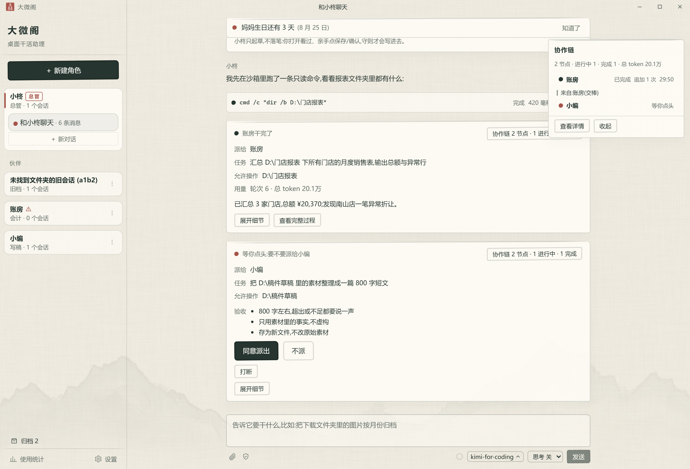
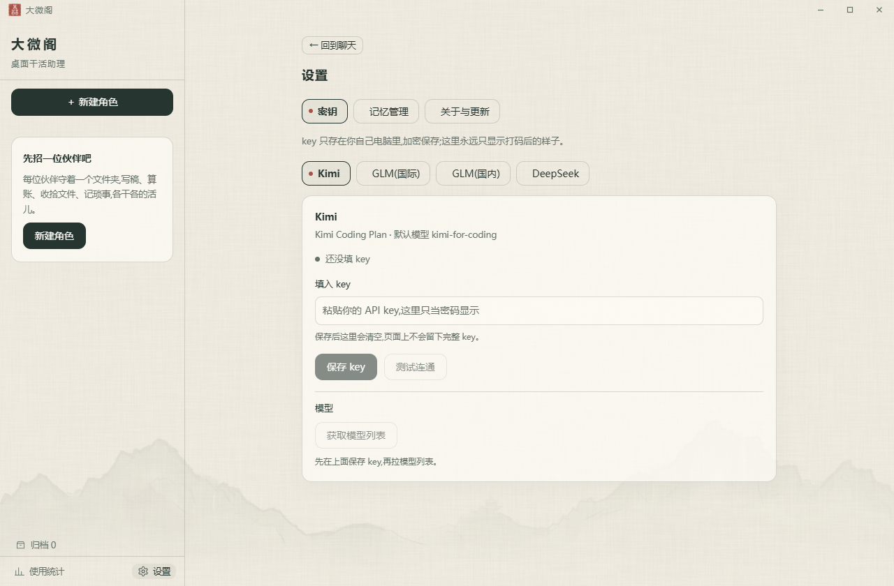
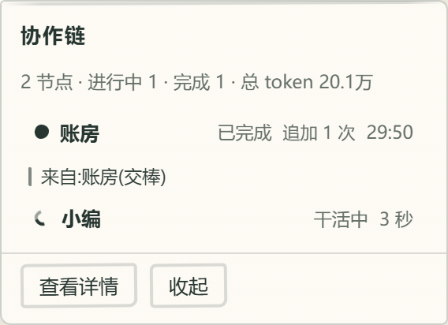

# 大微阁

水墨风桌面 AI 干活助理——内置总管小柊：简单的事直接答，复杂的事经你确认后派给角色去干，多角色接力协作，干完向你汇报。



## 核心特性

- **总管派活**：跟总管小柊说一句要干什么。简单的活它直接办，复杂的活会弹出派活确认卡，你点头之后才交给对应角色执行，干完回来汇报结果和用量，全程可回看。
- **多角色协作链**：「账房汇总完让小编写篇通报」这类接力任务，小柊依次派活、角色间只交定论（结论、关键数据、产物路径），看不到彼此的思考过程；多个独立任务可并行，中途能补充指令或打断。
- **协作链常驻面板**：界面右上角的小面板随时盯着谁在干活——空闲时缩成小窗不占地方，有活自动展开成流程图（角色、状态、用时一目了然）；点「查看详情」右侧展开大面板，每个角色一个标签页，完整干活过程随点随看，不用离开对话。
- **自动压缩上下文**：长对话接近模型容量上限时自动把早期内容总结成摘要，带着摘要继续聊；会话历史完整保留，摘要可随时回看。
- **技能市场，一句话安装**：跟任何角色说「帮我装个会议纪要技能」，它就联网搜索（内置精选目录 + GitHub 开源仓库），弹卡列出候选让你挑，再展示技能全文让你过目，两次确认后装好即用——只装纯文字技能，带脚本的明确拒收，没有开放许可的不进候选。
- **技能创作，越用越顺手**：干完一件值得复用的活，助手会问你要不要把这套做法存成技能；内置中文「技能创作指南」，随口说「帮我写个 XX 技能」也行——存技能同样要你确认后才落盘。
- **角色技能包**：每个角色自带干活套路（账房的表格核对、小编的写稿章法、文件管家的整理规则），任务匹配时自动取用；技能就是文件夹里的一份说明文档——可以自己写，放进设置页打开的技能文件夹刷新即装。纯文字套路，不含可执行代码。
- **跨角色记忆**：跟任何角色说「记住这个」，之后所有角色的新对话都带着这条记忆——偏好、事实、约定，不用重复交代；设置页能看到 AI 记了什么，可单条删除或一键清空；生活记事与纪念日提醒无缝并入同一套记忆。
- **角色就是文件夹加守则**：每个角色绑定一个工作文件夹，再用一份守则约定它的身份和做事方式。
- **沙箱跑命令**：需要跑脚本/命令时先弹命令确认卡（命令原文、在哪跑、能碰什么），批准后在受限沙箱执行——读得到全盘、只写得出授权文件夹，不带管理员权限；沙箱起不来就拒绝跑。
- **三家模型，随时切换**：支持 Kimi、GLM、DeepSeek，设置页填 API Key 后一键获取模型列表，勾选常用模型（可跨厂商），对话界面右下角随时切换；还可以给每个角色指定各自的默认模型——账房用一家、小编用另一家，互不干扰。
- **文档表格直接产出**：让角色做表格、写文稿、做演示，成果默认是正儿八经的 Office 文件——Excel 表格、Word 文档、PowerPoint 演示都能直接生成，数字带公式、格式成型；也能读你现有的表格和 Word 文档接着干。
- **文件操作先确认**：改你电脑里的文件前会展示确认卡，得到允许后才执行；删除进回收站。
- **记事与纪念日提醒**：可以记下生活事项和重要日期，并在需要时提醒你。
- **使用统计**：热力图、趋势图和真实活跃时长（间隔超过半小时不算连续），回顾你的使用情况。
- **应用内自动更新**：新版本可在应用内检查并更新。

## 下载安装

Windows 用户可前往 [GitHub Releases](https://github.com/yusencai1996-gif/daweige-agent/releases) 下载最新安装包。已装旧版可在应用内直接检查更新。项目仍在持续迭代，升级前请留意版本说明。

## 快速上手

1. 下载并安装大微阁。
2. 打开设置页，填写 Kimi、GLM 或 DeepSeek 中任意一家的 API Key。
3. 点击获取模型列表，勾选常用模型（可跨厂商勾多个）；对话界面右下角可随时切换。
4. 点击左上角新建角色，为角色起名、选择工作文件夹并挑选人设。
5. 开始对话；或者直接把整件事讲给总管小柊听。

| 新建角色 | 模型设置 |
|---|---|
|  |  |

## 总管派活与协作链

把事情直接讲给小柊听：简单的它自己答，复杂的先弹确认卡让你过目（派给谁、干什么、允许动哪些文件夹），同意后才派出。角色干活时每一步写文件照旧要你确认，干完小柊汇报验收要点与用量，过程随时可查。要多个角色接力时，上游只把「定论」交给下游，每个角色也只能碰自己被授权的文件夹：

| 派活确认卡 | 协作链面板（干活实时状态） |
|---|---|
|  |  |

点「查看详情」在右侧展开完整面板，每个角色一个标签页，干活过程实时同步、随点随看，不用离开对话：


## 技能与记忆

技能让角色更专业：账房按「多表核对」的套路查退款、剔跨期、对净额；小编按「内部通报」的章法成稿。技能可以一句话从市场安装（精选目录 + GitHub，双重确认、只装纯文字），也可以让助手照内置的「技能创作指南」现场写一个；设置页可管理技能、查看来源（内置/精选/自创/自装）、一键卸载；格式遵循开放的 Agent Skills 规范。

记忆让助手记得你：说一句「记住我偏好简洁」，换个角色、开个新会话依然生效；每一条都可在设置页查看与删除，删了就真的忘了。

| 技能管理 | 记忆管理 |
|---|---|
|  |  |

## 使用统计

热力图回顾一年的使用足迹，趋势图看最近每天各模型的用量分布：


## 从源码构建

需要 Node.js 24+ 与 Rust 工具链（命令沙箱辅助器用 Rust 编写，`cargo build --locked` 可复现）。

```bash
npm ci
npm run dist:win
```

纯前端预览（mock 数据）与测试：`npm run dev:renderer`、`npm test`。

## 目录结构

`src/main` 是 Electron 主进程，`src/renderer` 是 React 渲染层，`src/shared` 存放 IPC 契约与共享类型，`native/daweige-sandbox-helper` 是命令沙箱的 Rust 辅助器。

## 参与贡献

欢迎提交问题和改进，开发约定与提交前检查见 [AGENTS.md](AGENTS.md)。

## 许可证

本项目采用 [MIT License](LICENSE)。第三方开源组件与设计素材的归属和许可证见 [THIRD-PARTY-NOTICES.md](THIRD-PARTY-NOTICES.md)。
