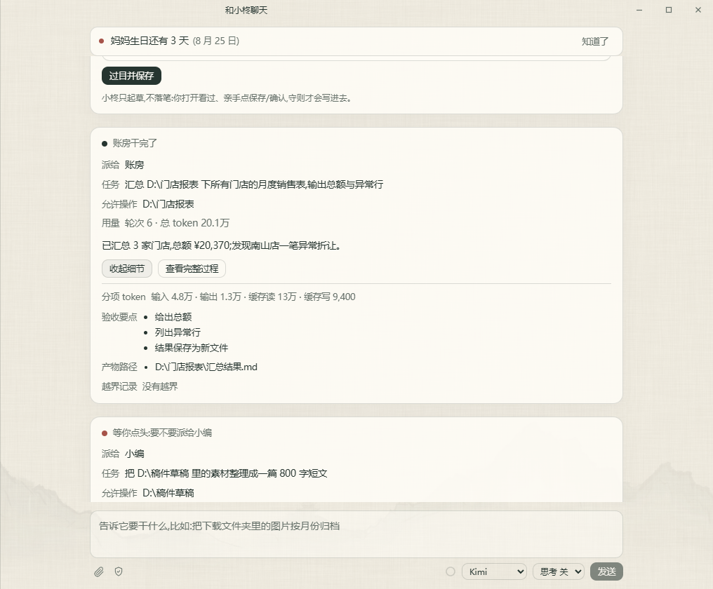

# 大微阁

水墨风桌面 AI 干活助理——内置总管小柊：简单的事直接答，复杂的事经你确认后派给角色去干，干完向你汇报。


## 核心特性

- **总管派活**：跟总管小柊说一句要干什么。简单的活它直接办，复杂的活会弹出派活确认卡，你点头之后才交给对应角色执行，干完回来汇报结果和用量，全程可回看。
- **角色就是文件夹加守则**：每个角色绑定一个工作文件夹，再用一份守则约定它的身份和做事方式。
- **三家模型，自带密钥即可使用**：支持 Kimi、GLM、DeepSeek，可在设置页填写 API Key 并一键获取模型列表。
- **文件操作先确认**：改你电脑里的文件前会展示确认卡，得到允许后才执行。
- **记事与纪念日提醒**：可以记下生活事项和重要日期，并在需要时提醒你。
- **使用统计**：用热力图和趋势图回顾使用情况。
- **应用内自动更新**：新版本可在应用内检查并更新。

## 下载安装

Windows 用户可前往 [GitHub Releases](https://github.com/yusencai1996-gif/daweige-agent/releases) 下载最新安装包。项目仍在持续迭代，升级前请留意版本说明。

## 快速上手

1. 下载并安装大微阁。
2. 打开设置页，填写 Kimi、GLM 或 DeepSeek 中任意一家的 API Key。
3. 点击获取模型列表，并选择要使用的模型。
4. 点击左上角新建角色，为角色起名、选择工作文件夹并挑选人设。
5. 开始对话，让角色在所选文件夹里协助你处理事情。

| 新建角色 | 模型设置 |
|---|---|
|  |  |

## 总管派活

把事情直接讲给小柊听：简单的它自己答，复杂的先弹确认卡让你过目（派给谁、干什么、允许动哪些文件夹），同意后才派出。角色干活时每一步写文件照旧要你确认，干完小柊汇报验收要点与用量，过程随时可查：

| 派活确认卡 | 干完汇报（可展开） |
|---|---|
|  |  |

## 使用统计

热力图回顾一年的使用足迹，趋势图看最近每天各模型的用量分布：


## 从源码构建

需要 Node.js 24 或更高版本。

```bash
npm ci
npm run dist:win
```

## 目录结构

`src/main` 是 Electron 主进程，`src/renderer` 是 React 渲染层，`src/shared` 存放 IPC 契约与共享类型。

## 参与贡献

欢迎提交问题和改进，开发约定与提交前检查见 [AGENTS.md](AGENTS.md)。

## 许可证

本项目采用 [MIT License](LICENSE)。第三方开源组件与设计素材的归属和许可证见 [THIRD-PARTY-NOTICES.md](THIRD-PARTY-NOTICES.md)。
